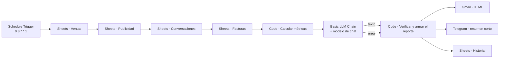

# Guía técnica: reporte semanal automático

Cómo poner el flujo en producción, cómo ajustar las reglas y qué límites tiene.
Para probarlo rápido basta el [README](README.md).

---

## 1. Arquitectura



| Nodo | Qué hace |
| --- | --- |
| **Lunes 8:00** | *Schedule Trigger* con cron `0 8 * * 1`, en la zona horaria de n8n (`GENERIC_TIMEZONE`). |
| **Sheets · …** | Cuatro lecturas en cadena, con *Execute Once* y *Always Output Data*: si una hoja está vacía, el reporte sale igual con ceros. |
| **Calcular métricas** | Calcula la semana anterior (lunes a domingo) contra la previa, los días fuera de lo normal y los hallazgos. Arma el bloque de datos para la IA. |
| **IA · Redactar resumen** | Recibe solo el bloque de datos. Temperatura 0.3 y máximo 400 tokens. Sus dos salidas (texto y error) van al verificador. |
| **Verificar y armar el reporte** | Revisa las cifras del texto, elige entre el texto de la IA y el resumen automático, y arma el correo HTML, el mensaje de Telegram y la fila de historial. |

Los dos nodos Code salen de `workflows/src/reporte.js`; el build solo cambia
`MODO` (`metricas` o `resumen`) y `FUENTE` (`demo` o `sheets`).

---

## 2. Puesta en producción

### 2.1 Hojas de origen

Una Google Sheet con estas pestañas (columnas en la fila 1). Las tres
primeras las llenan los otros proyectos del portafolio; si no los usas, basta
con que otra herramienta deje las mismas columnas.

```
Ventas:          fecha | pedido_id | sku | producto | cantidad | subtotal
Publicidad:      fecha | canal | gasto | clics
Conversaciones:  fecha | accion | intencion
Facturas:        fecha | estado | total
Historial:       semana | ventas | pedidos | gasto_publicidad | hallazgos | resumen_por | motivo
```

- `fecha` en formato `AAAA-MM-DD` (si trae hora, se usan los primeros 10 caracteres).
- Montos con punto decimal (`1234.50`); las comas de miles se aceptan.
- `accion` de conversaciones: `responder`, `derivar` o `silencio`, como las registra el bot.

El gasto de publicidad se puede cargar a mano, con una exportación semanal, o
con los nodos de Facebook Ads y Google Ads de n8n en otro workflow.

### 2.2 Reemplazos en el workflow

| Nodo | Qué reemplazar |
| --- | --- |
| Los 5 nodos de Google Sheets | `REEMPLAZAR_ID_HOJA` y la credencial de Google |
| Modelo de IA | Credencial del proveedor (se puede cambiar por cualquier modelo de chat de n8n) |
| Gmail · Enviar reporte | `REEMPLAZAR_CORREO_DUENO` y la credencial de Gmail |
| Telegram · Resumen corto | `REEMPLAZAR_CHAT_EQUIPO` y la credencial del bot |

Para probarlo sin esperar al lunes: abre el workflow y pulsa *Execute workflow*.

---

## 3. Ajustar las reglas

Las reglas están al inicio de `src/reporte.py` y `workflows/src/reporte.js`
(el test de paridad avisa si quedan distintas):

| Constante | Valor | Significado |
| --- | --- | --- |
| `CAMBIO_RELEVANTE` | 100 | 10.0 %: variación de ventas que merece mención |
| `ALZA_GASTO` | 200 | 20.0 %: alza de gasto en publicidad que se revisa si las ventas no suben |
| `META_ROAS` | 200 | S/ 2.00 vendidos por sol invertido |
| `META_BOT` | 700 | 70.0 % de consultas resueltas por el bot |
| `UMBRAL_Z` | 2 | desvíos estándar para marcar un día como fuera de lo normal |
| `SEMANAS_HISTORIA` | 8 | semanas con las que se compara cada día |

Después de cambiarlas: `python scripts/build_workflow.py` y vuelve a importar.

---

## 4. Límites conocidos

- **Días fuera de lo normal necesitan historia.** Con menos de 8 semanas de
  datos, los días que faltan cuentan como ventas en cero y la comparación es
  menos precisa. En un negocio nuevo conviene esperar dos meses antes de
  confiar en esa sección.
- **Feriados.** Un 28 de julio con pocas ventas aparecerá como anomalía. Es
  correcto (fue fuera de lo normal), pero la explicación la pone el dueño.
- **El verificador revisa números, no el sentido.** Si la IA escribe "subió"
  cuando bajó, las cifras pasan la revisión. Por eso el correo trae debajo los
  hallazgos armados por reglas, que no dependen de la IA.
- **Números del 0 al 10 se aceptan siempre.** Una IA que redondee 8.6 % a
  "9 %" pasaría. Se aceptó a cambio de no rechazar frases como "los 7 días".

---

## 5. Problemas de n8n encontrados al probar

- **Cuando falla el sub-nodo del modelo, la cadena no siempre usa la salida
  de error.** Por eso las dos salidas van al mismo nodo y el verificador
  revisa si llegó `text`: si no llegó, usa el resumen automático con el motivo
  "la IA no respondió".
- **La demo responde HTML.** *Respond to Webhook* con *Respond With: Text* y
  la cabecera `Content-Type: text/html; charset=utf-8`; sin esa cabecera, el
  navegador muestra el código en vez del reporte.
- **Reimportar un workflow activo no cambia la versión activa** (n8n 2.x):
  desactívalo, impórtalo y vuelve a activarlo.
