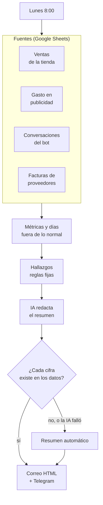
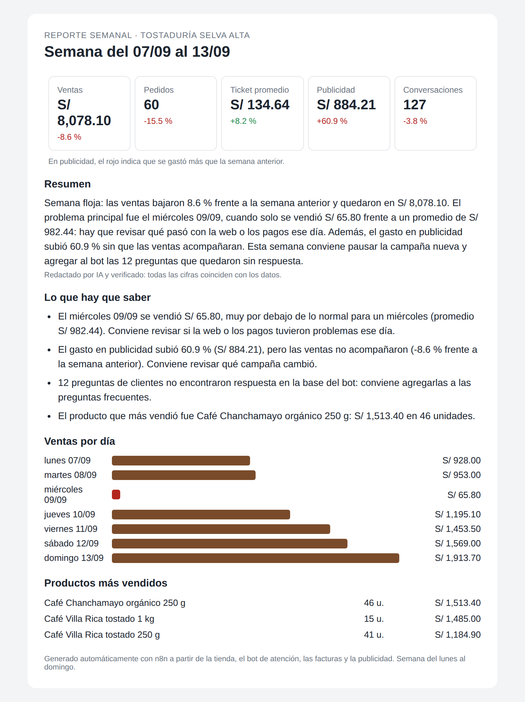

<h1 align="center">Reporte semanal automático con n8n e IA</h1>

<p align="center"><i>Cada lunes a las 8:00, lo que el dueño necesita saber, sin armar una hoja de cálculo y sin cifras inventadas</i></p>

<p align="center">
  
  
  
  
  
</p>

---

## Para qué existe este repositorio

Cada lunes alguien pasa la mañana juntando números: exporta las ventas de la tienda, copia el gasto de Meta y Google Ads, cuenta cuántos clientes escribieron y cuántas facturas llegaron. Arma una tabla que nadie lee con atención, y los problemas de verdad pasan desapercibidos: un día sin ventas porque falló la pasarela de pago, o una campaña que duplicó el gasto sin vender más.

**Este flujo junta los datos de toda la semana, calcula las métricas contra la semana anterior, detecta lo que se sale de lo normal y manda al dueño un correo de una página con lo que tiene que saber. La IA redacta el resumen, pero cada cifra que escribe se verifica contra los datos antes de enviarlo.**



Es la pieza que conecta el resto del portafolio: lee las hojas que llenan el [bot de atención](https://github.com/danielyatacoblas/n8n-ai-support-bot), el [lector de facturas](https://github.com/danielyatacoblas/n8n-invoice-ai-reader) y la [sincronización de la tienda](https://github.com/danielyatacoblas/n8n-woocommerce-stock-sync).

---

## Demo

<!-- VIDEO: arrastra aquí el .mp4 al editar el README en GitHub y deja solo la URL que genera. -->

<p align="center"></p>

<p align="center"><i>El reporte que genera el workflow de n8n con 10 semanas de datos
ficticios. Encontró solo los dos problemas escondidos en la semana: el
miércoles sin ventas y la campaña que subió el gasto sin vender más.</i></p>

---

## Qué calcula

Términos que conviene conocer:

- **Ticket promedio:** cuánto gasta en promedio cada pedido (ventas ÷ pedidos).
- **Ventas por sol invertido** (en marketing se le llama *ROAS*): cuántos soles de venta hubo por cada sol gastado en publicidad.
- **Puntaje z:** mide cuánto se aleja un valor de lo habitual, en "desvíos estándar". Un día con puntaje z de −2 o menos es un día muy por debajo de lo normal.

| Área | Métricas | Hallazgo que puede generar |
| --- | --- | --- |
| Ventas | Ventas, pedidos, ticket promedio, ventas por día, 3 productos más vendidos; todo contra la semana anterior | Las ventas cambiaron 10 % o más |
| Días fuera de lo normal | Cada día se compara con el **mismo día de la semana** en las 8 semanas anteriores (un martes con otros martes) | Un día con puntaje z de ±2 o más: posible caída de la web o de los pagos |
| Publicidad | Gasto, clics, ventas por sol invertido, costo por pedido | El gasto subió 20 % o más y las ventas no; o menos de S/ 2 vendidos por sol invertido |
| Atención | Conversaciones, % resuelto por el bot, derivadas a una persona | El bot resolvió menos del 70 %; 3 o más preguntas sin respuesta en la base |
| Facturas | Registradas, monto, en revisión | Facturas esperando revisión |

Los hallazgos salen de **reglas fijas**, no de la IA: siempre se detecta lo mismo con los mismos datos, y se puede probar.

---

## Cómo se evita que la IA invente cifras

El modelo recibe un bloque de datos con las cifras ya formateadas (`S/ 8,078.10`, `60.9 %`) y la instrucción de copiarlas tal cual. Cuando responde, un nodo Code:

1. Extrae cada número del texto de la IA.
2. Lo normaliza (`1,234.50` y `1234.5` son la misma cifra).
3. Comprueba que esté entre las cifras que se le dieron. Solo acepta además los números del 0 al 10, que aparecen al redactar ("los 7 días").

Si una sola cifra no está, **el texto se descarta** y se envía un resumen armado con los hallazgos. Si la IA falla o no responde, pasa lo mismo. El correo indica siempre cuál de los dos se usó y por qué.

| Texto de la IA | Resultado |
| --- | --- |
| "Las ventas bajaron 8.6 % y quedaron en S/ 8,078.10." | Aceptado |
| "Las ventas bajaron 12 % hasta S/ 7,900." | Descartado: `7,900` no está en los datos |
| (la IA no respondió) | Resumen automático |

---

## Probarlo en 2 minutos

```bash
pip install pytest
python scripts/generar_datos.py      # 10 semanas de datos ficticios
python -m pytest -v                  # 54 tests
```

**Con n8n de verdad** (Docker):

```bash
docker compose up -d
docker exec reporte_n8n n8n import:workflow --input=/workflows/reporte_demo.json
docker exec reporte_n8n n8n update:workflow --id=reportedemo --active=true
docker restart reporte_n8n
```

Abre <http://localhost:5678/webhook/reporte-demo?fecha=2026-09-14> y verás el
reporte. Para probar el verificador sin conectar un modelo, agrega un texto:
`&texto_ia=Las ventas fueron S/ 9,999.` La configuración de producción
(hojas, modelo, Gmail y Telegram) está en [`GUIA.md`](GUIA.md).

---

### El detalle que más cuesta ver

Para que el verificador sea confiable, las cifras deben escribirse **exactamente igual** en los datos que recibe la IA y en el código que la revisa. Por eso todo se calcula con enteros: montos en céntimos, porcentajes en décimas, y redondeo propio "alejándose de cero". `round(2.5)` da `2` en Python (redondeo bancario) y `Math.round(2.5)` da `3` en JavaScript: con decimales, una misma cifra podía escribirse distinto en el dato y en la revisión, y el verificador rechazaría textos correctos.

Un test **ejecuta el código de los nodos de n8n fuera de n8n** y compara métricas, hallazgos, el bloque de datos y la decisión del verificador contra Python, en cinco semanas distintas y con datos rotos a propósito.

---

## Estructura

```
├── data/                        # 10 semanas de ventas, publicidad, conversaciones y facturas
├── src/reporte.py               # métricas, días anormales, hallazgos y verificador
├── workflows/
│   ├── src/reporte.js           # el código de los dos nodos Code (+ el correo HTML)
│   ├── reporte_demo.json        # GET → el reporte en el navegador, SIN credenciales
│   └── reporte_produccion.json  # lunes 8:00 → hojas → IA → verificación → correo
├── scripts/                     # generador de datos y build de workflows
├── tests/                       # 54 tests (paridad JS ↔ Python y correo HTML)
└── docker-compose.yml           # n8n self-hosted
```

---

## Flujo de trabajo con Git

El repositorio sigue **Git Flow**: `main` siempre desplegable, `develop` como
integración, y una rama por cambio. Los merges son `--no-ff` para que cada
funcionalidad quede como un bloque legible en el historial, y cada versión
lleva su tag.

| Rama | Para qué |
| --- | --- |
| `main` | Solo versiones liberadas. Cada merge lleva su tag. |
| `develop` | Integración de todo lo terminado. |
| `feature/*` | Una funcionalidad nueva. |
| `fix/*` | Una corrección concreta. |
| `release/*` | Preparación de la versión; luego se fusiona a `main` y `develop`. |

Los mensajes siguen [Conventional Commits](https://www.conventionalcommits.org/):
`feat:`, `fix:`, `test:`, `docs:`, `chore:`, con el porqué del cambio en el cuerpo.

---

## Documentación

| Documento | Contenido |
| --- | --- |
| [`GUIA.md`](GUIA.md) | Puesta en producción, formato de las hojas, cómo ajustar las reglas y límites |
| [`CHANGELOG.md`](CHANGELOG.md) | Cambios por versión |

---

## Licencia

[MIT](LICENSE) · Daniel Yataco Blas

> Proyecto de demostración construido con **datos ficticios**. La tostaduría,
> sus ventas y sus clientes no existen.
